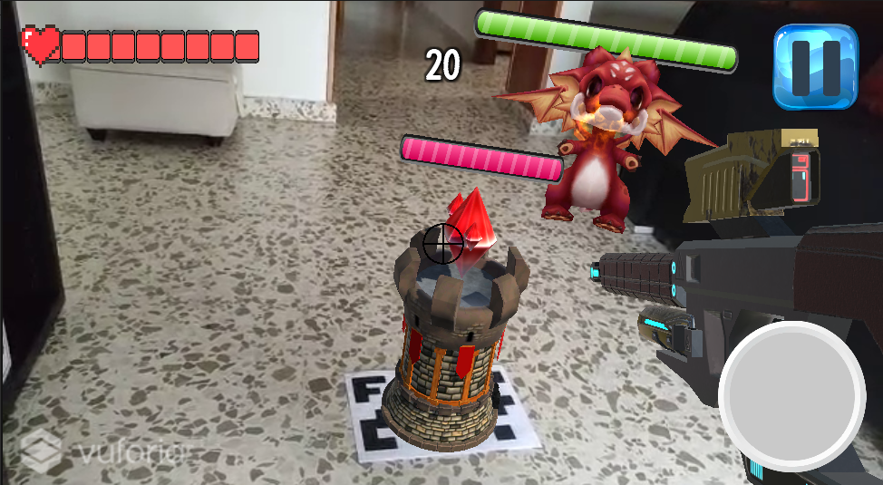
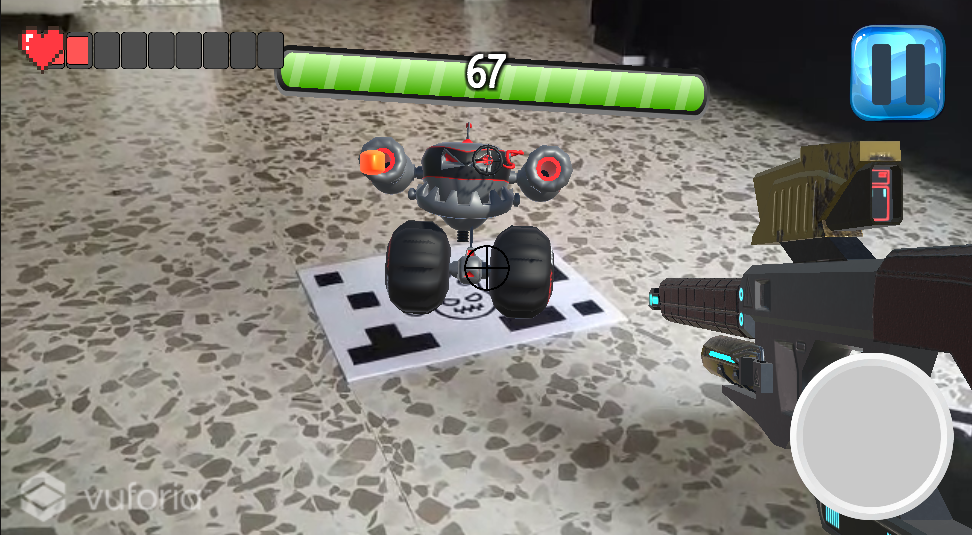

# **SHOOT OPERATION**⚔
<li>✅Totalmente Gratuito✨</li>
<li>📷Tome tu teléfono y elimine a todos los enemigos👾</li>
<li>💸Gana PINFCOINS</li>
 

Proyecto realizado por : 
<li>Alejandro Serrano Fernández</li>
<li>Pedro Antonio Navas Luque</li>

 
*📥Instalación🖱*
<li>Descargar e imprimir los targets que se ponen a disposición para el usuario. El tama~no ideal será el estándar A4.</li>				
<li>Descargar e instalar la apk ofrecida de Shoot Operation.</li>
<li>Colocar o esconder los targets por toda la zona de juego. Estos pueden colocarse o esconderse por el mismo usuario o por otro.</li>
<li>Iniciar la aplicación y pulsar en iniciar juego.</li>
<li>El usuario, nada más iniciar, obtendrá un arma con el que podrá eliminar a los enemigos, aunque no la torre final. Para eliminar la torre, es necesario que el usuario encuentre el target que le permite obtener el bastón mágico.
Este bastón tiene la energía y el daño suficiente para acabar con ella,
aunque cerca aguarda un enorme dragón que no permitirá que acabes tan
rápido con ella.</li>
<li>Pulsando el botón de pausa se desplegaran tres opciones: Continuar, volver al menu principal y volver a empezar la partida.</li>
<li>El tiempo se podrá observar en todo momento durante la partida.</li>
<li>Si varios usuarios están jugándolo, ganará aquél que menor tiempo haya empleado para completar el juego.</li>
 

 

 
>
 
